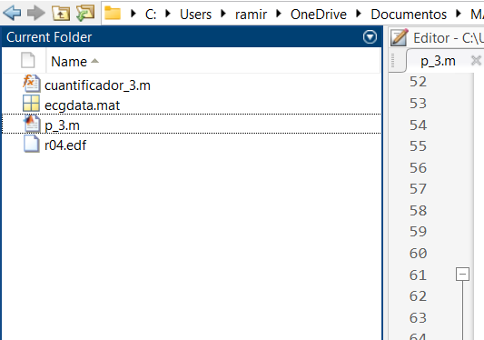

# Reporte de Práctica 3: Introducción al manejo de señales biomédicas: Señal de ECG
Telesalud y Telemedicina  
Ingeniería Biomédica  
Departamento de Ingeniería Eléctrica y Electrónica, Tecnológico Nacional de México/IT Tijuana, Blvd. Alberto Limón Padilla s/n, Tijuana, C.P. 22454, B.C., México.  
Prof. Fortunato Ramírez Arzate  
Unidad 1: Introducción a la Telesalud y a la Telemedicina  
Ramirez Rodriguez Carlos Azael  
22212267  

## Introducción

El estudio de las señales bioeléctricas constituye una de las bases fundamentales en el análisis de sistemas biomédicos, ya que permite comprender el comportamiento fisiológico del cuerpo humano a través de la actividad eléctrica de diferentes órganos. Entre estas señales, la señal electrocardiográfica (ECG) es una de las más relevantes, pues refleja la actividad eléctrica del corazón y proporciona información esencial para el diagnóstico y monitoreo de patologías cardiovasculares.

En esta práctica se trabajará con el procesamiento digital de señales de ECG empleando **MATLAB** como herramienta de análisis. El enfoque principal estará en tres etapas fundamentales del tratamiento de señales:

- **Normalización**: permite ajustar la amplitud de la señal a un rango predefinido, lo cual facilita su comparación, almacenamiento y posterior procesamiento.
- **Amplificación**: mejora la visibilidad de la señal, resaltando componentes de interés que de otra forma serían difíciles de analizar debido a su baja magnitud.
- **Cuantificación**: consiste en representar la señal continua en niveles discretos de amplitud, emulando el proceso realizado en los sistemas de adquisición mediante convertidores analógico-digitales (ADC).

## Descarga/Adquisición de datos

Para iniciar con el desarrollo de la práctica, se obtuvo un archivo de una señal de ECG desde una base de datos en línea. La base de datos en cuestión fue la siguiente:

* **Señal de electrocardiograma (ECG)**. Utilizar una señal de la base de datos que se desee. Por ejemplo:

  * [PhysioNet Database](https://physionet.org/about/database/)  

El archivo utilizado para el desarrollo de la práctica fue el siguiente: [ecgdata.mat](p_3/ecgdata.mat).

## Configuración y despliegue en Matlab

Una vez descargado nuestro archivo, se guardó en la carpeta de trabajo para abrirla desde la interfaz de **MATLAB**, tal como se muestra en la siguiente figura.  

  

## Cuantificación de la señal

## Generación y análisis de fragmentos

## Análisis de resultados

## Conclusión

